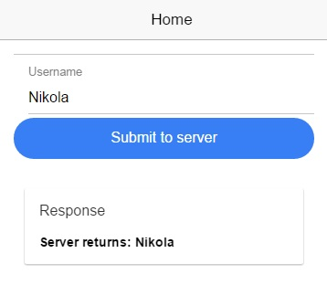

# Ionic2ServerSendTest

The simplest example on how to POST data from Ionic2 to PHP server. You can take a look at the tutorial accompanying this code [here](http://www.nikola-breznjak.com/blog/ionic2/posting-data-from-ionic-2-app/).

You can take a look at the code for how to do this same thing in Ionic1 [here](http://www.nikola-breznjak.com/blog/codeproject/posting-data-from-ionic-app-to-php-server/).

The version for Ionic3 is [here](http://www.nikola-breznjak.com/blog/javascript/ionic3/posting-data-ionic-3-app-php-server/).

